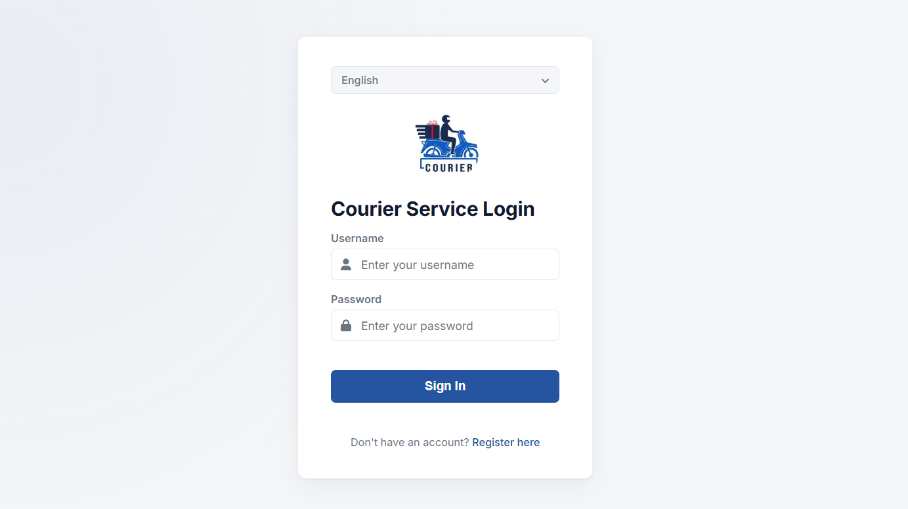
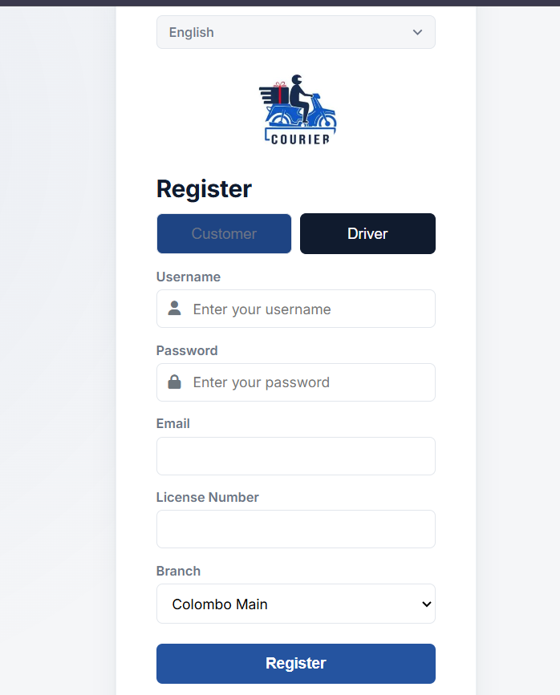
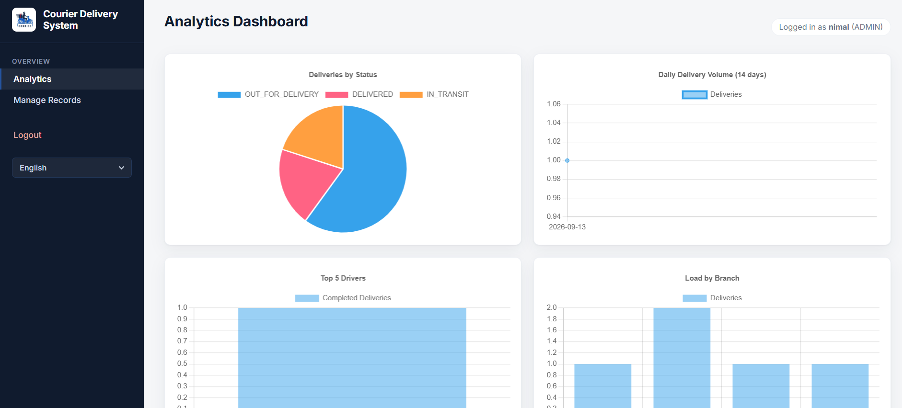
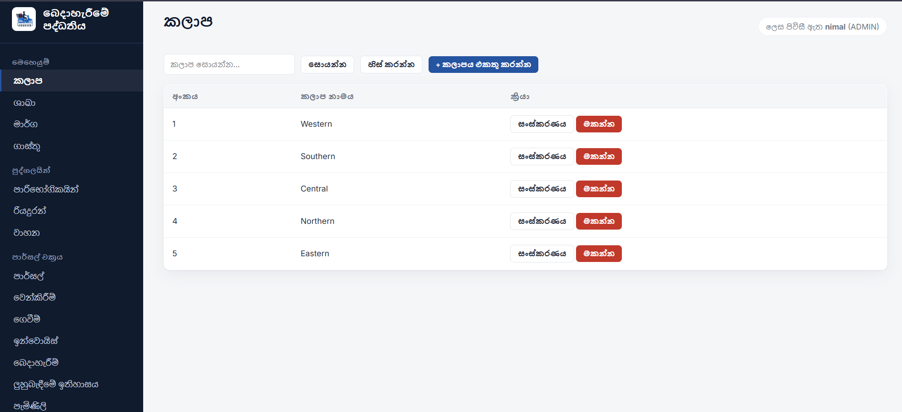
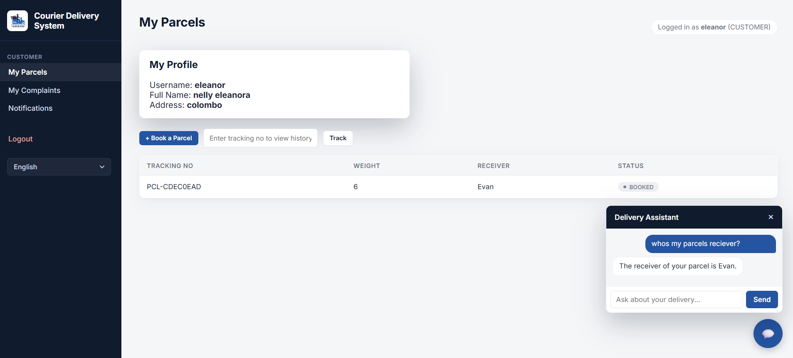
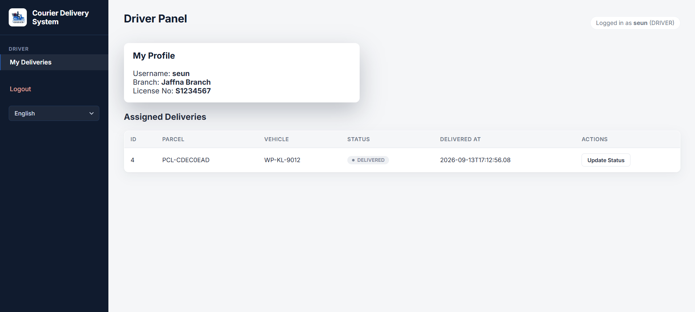
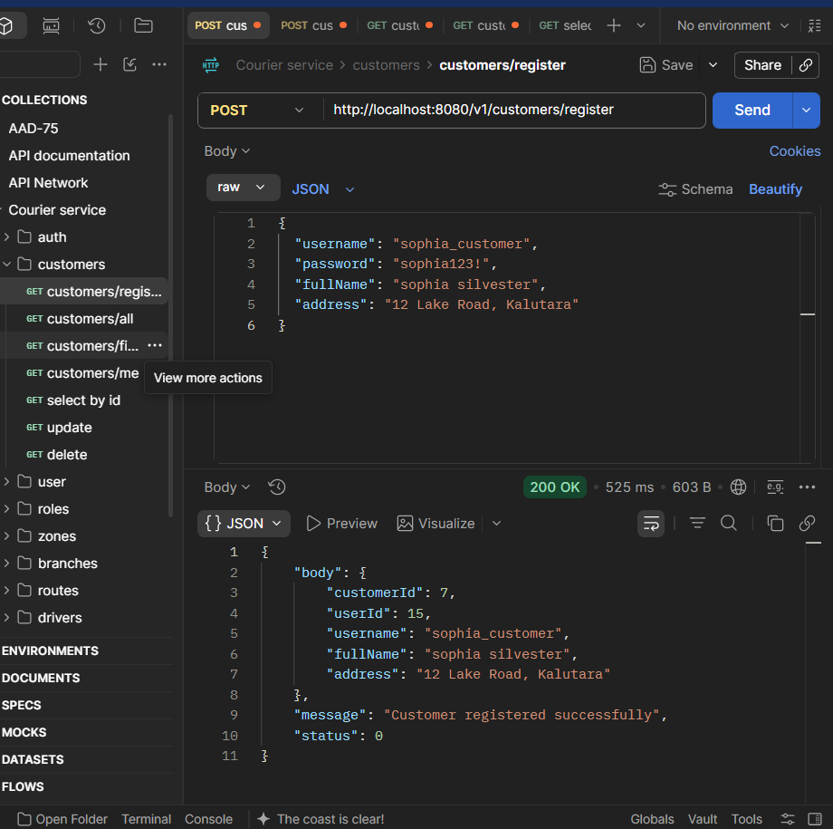
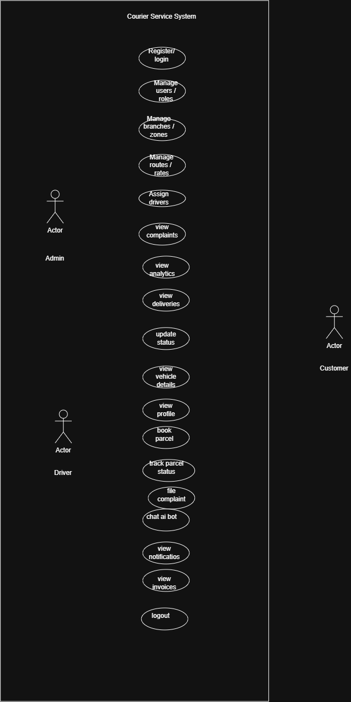

# 📦 Courier Delivery System — RESTful API (aad_project)

A full-stack **Courier Delivery Management System** built for **ITS1114 – Advanced API Development**. The backend is a secured Spring Boot REST API with JWT authentication and role-based access control (RBAC); the frontend is a vanilla HTML/CSS/JS client served from Spring Boot's static resources.
 
---

## 🚀 Features

- **JWT Authentication** with Spring Security (stateless sessions)
- **Role-Based Access Control** — three roles: `ADMIN` (Dispatch Manager), `USER` (Driver), `GUEST` (Customer), modeled with a proper `Role` entity (not comma-separated strings)
- **BCrypt password encoding** (strength 12)
- **17 normalized JPA entities** covering the full delivery lifecycle: Users, Roles, Customers, Drivers, Branches, Zones, Vehicles, Parcels, Bookings, Deliveries, Payments, Invoices, Rates, Routes, Complaints, Notifications, Tracking History
- **Consistent `CommonResponse` wrapper** for every API response (`status`, `data`/`body`, `message`)
- **Google Gemini–powered AI Delivery Assistant** — a floating chatbot widget using a RAG-lite pattern (real parcel/booking data injected as context)
- **Analytics Dashboard** with Chart.js — status summary, deliveries-per-day, top drivers, branch load
- **Async email notifications** (Gmail SMTP) for booking confirmation and driver assignment
- **Multi-language frontend (i18n)** — English & Sinhala via a JSON dictionary
- **SLF4J/Logback logging** throughout the service layer
- **Input validation** via `jakarta.validation` (`@Valid`) on all write endpoints
---

## 🛠️ Tech Stack

| Layer | Technology |
|---|---|
| Language | Java 21 |
| Framework | Spring Boot 4.1.0 |
| Security | Spring Security 6, JWT (JJWT 0.12.3), BCrypt (strength 12) |
| Persistence | Spring Data JPA / Hibernate |
| Database | MySQL |
| Build Tool | Maven |
| Object Mapping | Lombok |
| Logging | SLF4J + Logback |
| AI | Google Gemini API |
| Email | Spring Mail (Gmail SMTP) |
| Frontend | HTML5, CSS3 (custom properties), vanilla JavaScript, jQuery, Chart.js |
| API Testing | Postman |
 
---

## 🏗️ Architecture Overview

```
Client (HTML/CSS/JS)
        │  fetch() + Bearer JWT
        ▼
┌───────────────────────────────┐
│      Spring Boot REST API      │
│  ┌───────────────────────────┐ │
│  │ JwtAuthenticationFilter    │ │  ← reads "Authorization: Bearer <token>"
│  └─────────────┬─────────────┘ │
│                ▼               │
│  ┌───────────────────────────┐ │
│  │ SecurityConfig              │ │  ← permitAll() public routes,
│  │ (@EnableMethodSecurity)     │ │     @PreAuthorize on protected ones
│  └─────────────┬─────────────┘ │
│                ▼               │
│  ┌───────────────────────────┐ │
│  │ Controller → Service        │ │  ← CommonResponse wrapper
│  │            → Repository     │ │
│  └─────────────┬─────────────┘ │
│                ▼               │
│         MySQL Database          │
└───────────────────────────────┘
```

**Request flow for a protected endpoint:**
1. Client logs in via `POST /v1/auth/login` → receives a signed JWT.
2. Client stores the token and sends it as `Authorization: Bearer <token>` on every subsequent call.
3. `JwtAuthenticationFilter` intercepts the request, validates the token via `JwtUtil`, and loads the `UserDetails`.
4. `SecurityContextHolder` is populated so `@PreAuthorize` checks and `Principal` injection work downstream.
5. The controller delegates to a service, which talks to Spring Data JPA repositories, and returns a `CommonResponse`.
---

## 📂 Project Structure

```
aad_project/
├── src/main/java/com/example/aad_project/
│   ├── controller/        # REST controllers (one per resource)
│   ├── service/            # Business logic
│   ├── repository/         # Spring Data JPA repositories
│   ├── entity/              # JPA entities (17 tables)
│   ├── dto/                 # Request/response DTOs
│   ├── security/            # JwtUtil, JwtAuthenticationFilter, SecurityConfig
│   ├── constant/            # CommonResponse, enums (ParcelStatus, PaymentStatus, ComplaintStatus)
│   └── config/              # AsyncConfig, mail/AI config
├── src/main/resources/
│   ├── static/              # Frontend: index, login, register, customer, driver, dashboard HTML + css/js
│   ├── i18n/                 # en.json, si.json (multi-language dictionaries)
│   ├── application.properties
│   └── application-secrets.properties   # gitignored — DB/mail/AI credentials
└── pom.xml
```
 
---

## ⚙️ Prerequisites

- JDK 21+
- Maven 3.9+ (or use the bundled `./mvnw`)
- MySQL 8+ running locally
- An IDE (IntelliJ IDEA recommended)
- A Gmail account with an **App Password** (for email notifications)
- A Google Gemini API key (for the AI chatbot)
---

## 🔧 How to Set Up & Run the Project

### 1. Clone / open the project
```bash
git clone <your-repo-url>
cd aad_project
```

### 2. Create the database
The app auto-creates the schema, but MySQL itself must be running:
```sql
CREATE DATABASE IF NOT EXISTS aad_project;
```
Confirm the port in `application.properties` matches your MySQL instance:
```properties
spring.datasource.url=jdbc:mysql://localhost:3307/aad_project?autoReconnect=true&createDatabaseIfNotExist=true
```
(Change `3307` to `3306` if you're using MySQL's default port.)

### 3. Add your secrets file
Create **`src/main/resources/application-secrets.properties`** (this file must live here, not in the project root, or `${}` placeholders won't resolve). Use **raw values**, not `${...}` wrappers:
```properties
spring.datasource.username=root
spring.datasource.password=YOUR_DB_PASSWORD
 
jwt.secret=YOUR_LONG_RANDOM_JWT_SECRET
 
spring.mail.username=your.email@gmail.com
spring.mail.password=YOUR_GMAIL_APP_PASSWORD
app.mail.from=your.email@gmail.com
 
ai.api.key=YOUR_GEMINI_API_KEY
```
This file is already covered by `.gitignore` — never commit real credentials.

### 4. Build the project
```bash
./mvnw clean install
```

### 5. Run the application
```bash
./mvnw spring-boot:run
```
The app starts on **http://localhost:8080**.

> ⚠️ **Important:** Always test through **port 8080** (the actual Spring Boot server), never through IntelliJ's built-in preview server (port 63342). Absolute static paths (e.g. `/i18n/en.json`), Spring Security's `permitAll()` rules, and `localStorage` JWT tokens only behave correctly when everything is served from the same origin — port 8080.

### 6. Open the frontend
Navigate to:
- `http://localhost:8080/index.html` — landing page
- `http://localhost:8080/register.html` — customer/driver registration
- `http://localhost:8080/login.html` — login
- `http://localhost:8080/customer.html`, `/driver.html`, `/dashboard.html` — role-specific dashboards
### 7. Test the API in Postman
Import `aad_project_postman_collection.json` (generated alongside this README) into Postman:
1. Postman → **Import** → select the JSON file.
2. Set the collection variable `base_url` (defaults to `http://localhost:8080`).
3. Run **Auth → Login**; the test script auto-captures the JWT into the `token` collection variable.
4. All other requests inherit the Bearer token automatically from the collection-level auth.
---

## 🔐 Authentication & Roles

| Role | Represents | Example permissions |
|---|---|---|
| `ADMIN` | Dispatch Manager | Manage branches, zones, rates, roles, users, view analytics |
| `USER` | Driver | View assigned deliveries, update delivery status, view own profile |
| `GUEST` | Customer | Register, book parcels, track shipments, raise complaints |

**Public (no token required) endpoints:**
- `POST /v1/auth/login`
- `POST /v1/customers/register`
- `POST /v1/drivers/register`
- `GET /v1/branches/all` (needed by the registration page's branch dropdown)
- Static frontend pages/assets (`/*.html`, `/css/**`, `/js/**`, `/i18n/**`, `/assets/**`)
  Every other endpoint requires:
```
Authorization: Bearer <jwt-token>
```
 
---

## 📋 Standard Response Format

Every endpoint returns a `CommonResponse`:
```json
{
  "status": 200,
  "data": { "...": "..." },
  "message": "Success"
}
```
 
---


## 📸 Screenshots

### Login page(sign-in)


### Register page - Driver(sign-up)


### Admin Analytics Dashboard


### Admin Dashboard(lang translated)


### Customer Panel(with AI chatbot implemented)


### Driver Panel


### Mail of successful Driver Registration


### Postman testing 



-----

## System Architecture (Use case)


## ER diagram


## Class diagram